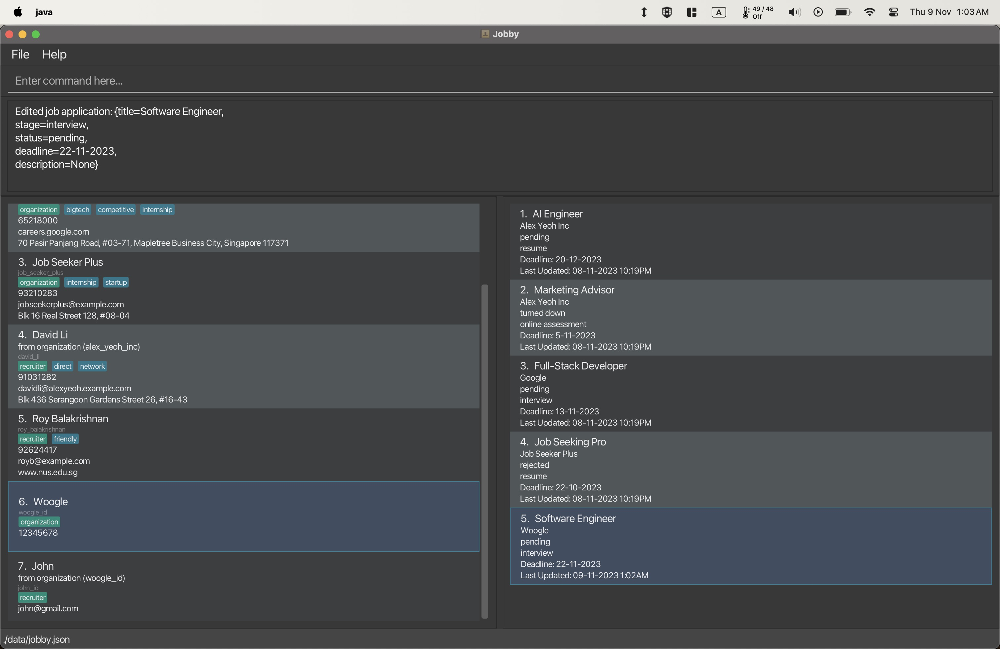
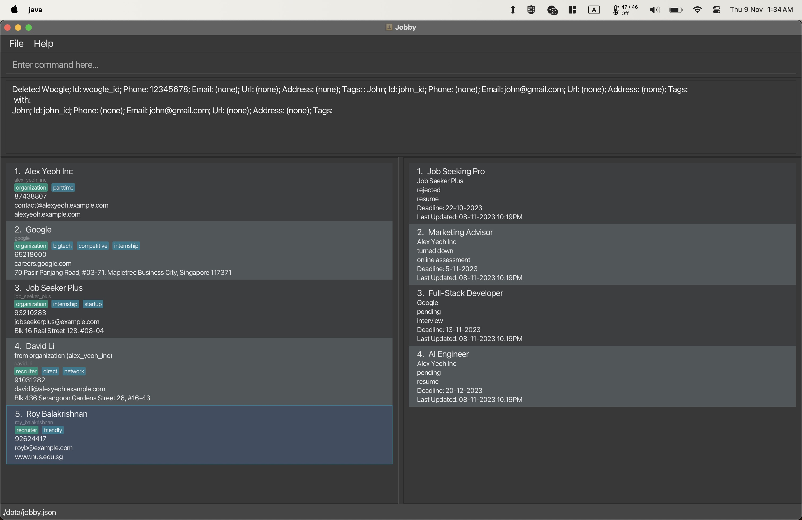

**Jobby** is a **desktop app for managing job applications and contacts, optimized for use via a Command Line Interface (CLI)** while still having the benefits of a Graphical User Interface (GUI). Jobby can help you manage tracking your job applications and contacts in a more streamlined fashion. If you can type fast, Jobby can get your contact management tasks done faster than traditional GUI apps.

* Table of Contents
{:toc}

--------------------------------------------------------------------------------------------------------------------

## Installation

1. Ensure you have Java `11` or above installed in your Computer.

1. Download the latest `jobby.jar` from [here](https://github.com/AY2324S1-CS2103T-W08-3/tp/releases).

1. Copy the file to the folder you want to use as the _home folder_ for your Jobby Application.

1. Open a command terminal, `cd` into the folder you put the jar file in, and use the `java -jar jobby.jar` command to run the application.<br>
   A GUI similar to the below should appear in a few seconds. Note how the app contains some sample data.<br>
   

1. Type a command in the command box and press Enter to execute it - e.g., typing **`help`** and pressing Enter will open the help window.<br>

1. Refer to the [Features](#features) below for details of each command.

--------------------------------------------------------------------------------------------------------------------

## Starter Guide
Welcome to Jobby's documentation! This quick start guide will give you an introduction of 80% of Jobby's 
functionalities that you will use on a daily basis. 

This guide will be done in an example workflow that you will likely experience while using Jobby to get you accustomed to all of Jobby's commands.

> ### You will learn
> - How to add contact into Jobby
> - How to edit contact in Jobby
> - How to add application in Jobby
> - How to use core features like find, remove
> - How to delete data in Jobby
> - And more...

### GUI Legends

Below is a labelled diagram of our GUI


### Adding `Contact`
Jobby can create `Contacts`. In the form of `Organization` and `Recruiter`, which you can add into your database with simple CLI commands.

Let's say you want to track your job application for the `Organization: Woogle`, with a `Recruiter: John`.

You can add the `Organization` into Jobby with a simple command: 
```add --org --name Woogle --id woogle_id```


You can then add a **recruiter** that's related to the "Woogle" organization like so:: 
```add --rec --name John --id john_id --oid woogle_id```


> To find out all of `Organization` and `Recruiter`'s flags, go [organization documentation]()
> and [recruiter documentation]()

### Adding `Application`
Let's say now you want to apply to `Woogle` for the position of `Junior Software Engineer` role. You will be able to create
an `Application` for this company with the by including the `Organization ID` in the command: 
`apply woogle_id --title Software Engineer --by 22-11-2023`


`Application` will automatically generates the fields if there are no inputs on your end.
- `Status: Pending`
- `Stage: Resume`

> You will be able to add different details of `Application`, see the [applcation documentation]() here.

### Editing `Contact`
Now that you have both your Contacts and Applications. You received new informations about your `Contacts`, you will have to edit your `Contact` data.

We can do so with the `edit` CLI command with the desired id and input.

Let's say we want to change the phone detail of `Organization: Woogle` and email of `Recruiter: John`.
We can use the commands:
`edit woogle_id --phone 12345678` and `edit john_id --email john@gmail.com`


After executing the commands,
`Organization: Woogle`'s number changed to `phone: 12345678`.
`Recruiter: John`'s email changed to `Email: john@gmail.com`.

> To find more ways to `edit` `Organization` and `Recruiter`, see the [edit documentation](LINK TO ORGANIZATION AND RECRUITER DOCUMENTATION)

### Editing `Application`
For your `Woogle` application, you managed to pass the resume screening stage! And you will have to change your `Stage` to 
the `Interview` stage.

You will be able to do it simply with:
`edit --application 5 --stage interview`




This will change your `Stage` from `Resume` to `Interview`, indicating that you are onto the next stage of the application process.
> To find more more fields of the `Application` to edit, see the [edit documentation](LINK TO EDIT APPLICATION DOCUMENTATION)

### Get `Reminder`
During your internship application process, you might feel that there are many deadlines that you have to keep track of,
in Jobby, we have a `Remind` command that will help you sort your applications by their `Deadlines`.

You can do so with a simple command:
`remind --earliest` 
to see your application deadlines from the earliest to latest.


> To find out more ways to use `remind`, see the [remind documentation](LINK TO REMIND DOCUMENTATION).

### Finding `Organization` and its related `Applications
Let's say there is a specific organization application you are looking for, like **Woogle**, you will be able to easily find it via
this command: ```find woogle```

SCREENSHOT

> To find out more ways to use `find`, see the [find documentation](LINK TO find DOCUMENTATION).


### List everything back
After filtering, you want to get back the entire list of organizations and applications in Jobby. You can simply use
the `list` command.


### Deleting data
After you are done with your application, or if you realised that one of the `Contact` in Jobby no longer exists, you can
feel free to `delete` the `Organization` from Jobby.

In our case, let's delete `Woogle` from Jobby by executing the command:
`delete woogle_id --recursive`

This will delete `Woogle` along with all of its **applications** and **recruiters**. 




### Next Steps
By now, you should know the basics of how Jobby works!

Checkout [Understanding Jobby's command syntax](#Understanding-Jobby's-command-syntax).

--------------------------------------------------------------------------------------------------------------------

## Understanding Jobby's command syntax

Explanation of how Jobby's commands are structured_

--------------------------------------------------------------------------------------------------------------------

## Command documentation

(Detailed information on each command with the constraints, possible errors and feature flaws)


--------------------------------------------------------------------------------------------------------------------

## Glossary

(Terms that may be difficult to understand here.)

--------------------------------------------------------------------------------------------------------------------

## Issues

(Where to report issues and what bugs currently exist)

